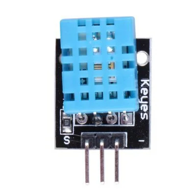
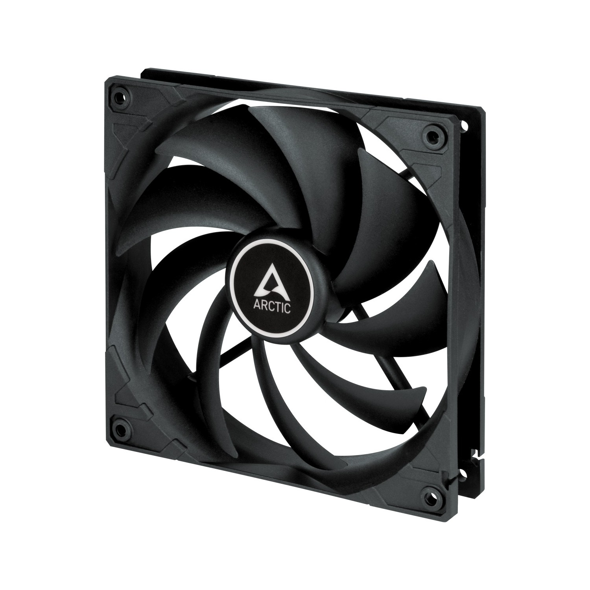
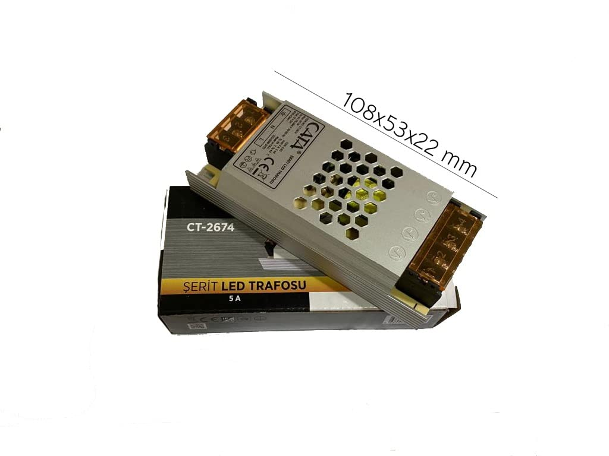
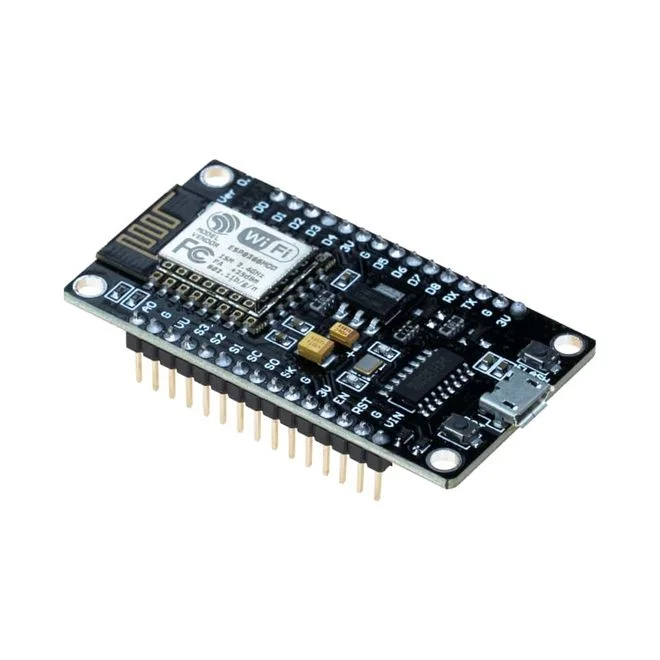
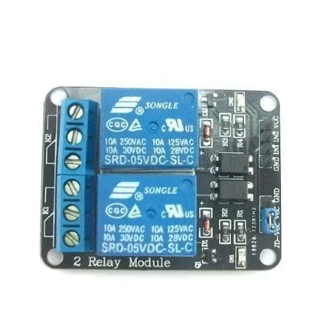
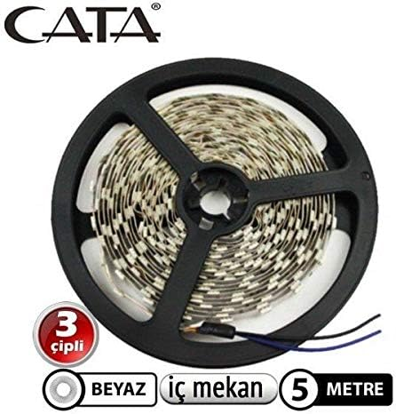

# ESPHome Fan ve Şerit Led Kontrolü

Bu proje ile benim gibi kapalı alanda birden fazla bilgisayarı veya oyun konsolu gibi cihazlarınızı sessiz ve termostat kontrollü bir fanla nasıl havalandırcağınızla birlikte kabininiz veya odanızda hoş bir aydınlatmayı nasıl yapacağınızı açıklaycağım.

Yazılım olarak ESPHome ve Home Assistant dan yararlanacağız. Donanım olarak standar 12v bilgisayar fanı (PWM), Sıcaklık sensörü (DHT11), 2 Kanal 5 V Röle Kartı, ve şerit led kullanacağız.

## Motivasyon

Akıllı ev projelerine başladıktan sonra eski cihazım olan MSI GE60 2OE üzerine Home Assistant kurulumu yaptım. Genel olarak evden çalıştığım için çalışma odamda şirket bilgisayarı ve özel işlerim içinde bir tane MacBook Pro cihazım sürekli olarak çalışıyor. Ancak odamın küçük olması ve bu cihazların çalışma masamın üzerinde durmasından hoşlanmadığım için yüksek bir dolapta sürekli olarak hazır bir şekilde bekletiyordum. 

Ancak aynı dolap içerisinde 3 bilgisayar birden sürekli olarak çalıştığında ve bir hava sirkülasyonu olmadığında iç sıcaklar 40 - 45 C lere kadar çıkıyor cihaz iç sıcaklıkları da artık çalışacamayacak hatta cihazlara zarar verecek noktaya geliyordu. Bu yüzden beni rahatsız etmeyecek ancak cihazlarıda sağlıklı olarak çalışmasını sağlayacak bir çözüm için arayışa başladım. Proje bu aşamaya gelene kadar bir çok deneme yanılma yaptım ancak benim için en uygun bu son hali oldu.


## Özellikler
Ana özellikler:

- Sıcaklık sensörüne göre dinamik olarak hızı ayarlanan bir fan 
- **Ayarlanabilir hız kontrolleri**. Fan çalışma başlangıç sıcaklığı, min. çalışma hızı ve maximum çalışma sıcaklığı ayarları yapılabilir durumdadır.
- Kontrol ve raporlama amacıyla Home Assistant'a bağlanmak için ESP8266'nin Wifi'sini kullanır
- ESP8266 bağımsızdır ve bu nedenle soğutma işlevi Wifi olmadan çalışmaya devam edecektir. Çalıştırmak için HomeAssistant'a veya Wifi'ye ihtiyaç duymaz. Wifi yalnızca kurulum, manuel kontrol ve raporlama için gereklidir.
- Cihazın kendisinde ekrana gerek yoktur, tüm yönetim Ev Asistanı üzerinden yapılır
- Sistem şu an için tek fan kullanıyor. Ancak yaz aylarında veya başka koşullarda yeterli olmaz ise fan sayısı çoğaltılabilir.
- **Kodlama ihtiyacı yoktur.** Aslında tüm işi yapan repo içerisinde bulunan yaml dosyasıdır.
- **Direnç, kapasitör veya zor lehimlemeye gerek yoktur.** Fan ve sıcaklık sensörü doğrudan ESP8266'nin pinlerine takılır.
- Sistem asıl işi haricinde çalışma alanınıza veya odanıza çok hoş bir ambiyans aydınlatma da katacaktır.


Bu Home Assistant'tan bir ekran görüntüsü. Bu kontrol panelini nasıl kuracağınızı size göstereceğim.

## Görseller


## Parçalar (~715₺ - 25$)

- **[DHT11](https://www.robotistan.com/dht11-isi-ve-nem-sensoru-kart)** - Isı ve Nem Sensörü. - 3 pinli anakartı kullanıyorum. Maliyet 35,5₺(1,25 $)<br>

- **12v PWM 4-pin Bilgisayar Fanı** - Ben [Arctic F14 Pwm Pst, 140MM 4pin Pst](https://www.hepsiburada.com/arctic-f14-pwm-pst-140mm-4pin-pst-pwm-paylasim-destekli-siyah-cerceve-siyah-kanat-kasa-fani-ar-acfan00219a-p-HBCV000001BYCW?magaza=Hepsiburada) kullanıyorum. Herhangi bir 12v PWM ile kontrol edilebilen fan kullanabilirsiniz. Maliyet 355₺ (12,45$). Gürültüyü önemsiyorsanız ve çok fazla havayı hareket ettirmeniz gerekiyorsa yüksek kaliteli fanlar almanızı öneririm<br>.

- **12v Güç adaptörü** - Ben şerit ledleride kullandığım için, min. 5A bir güç kaynağı kullandım. [CATA CT 2674 5 AMPER 60W](https://amzn.eu/d/9yCUfTn)  Maliyet 85₺ (3$)  Eğer sadece fan için bir sistem yapacaksanız fanlarınıza bağlı olarak 1A veya 2A yeterli olacaktır.<br>

- **[ESP8266](https://www.robotistan.com/nodemcu-lolin-esp8266-gelistirme-karti-usb-chip-ch340)**. Herhangi bir ESP yi kullanabilirsiniz. ESP32,D1 Mini vs. ESP8266 Maliyeti 130₺ (4,55$)<br>

- **[2 Kanal 5 V Röle Kartı](https://www.robotistan.com/2-way-5v-relay-module-2li-5v-role-karti-1)** 2 Farklı şerit led çalıştıracağım için 2 kanallı kullandım. Siz ihtiyacınıza göre değiştirebilirsiniz. Maliyet 40₺ (1,4$)<br>

- **[Şerit Led](https://www.hepsiburada.com/cata-10-cipli-serit-led-isik-aydinlatma-beyaz-isik-5-m-ic-mekan-pm-HB000019B7XD)** Ben 5m aldım ve ihtiyacıma göre 2 parça olarak kullandım. Farklı renk veya ürün kullanabilirsiniz. Şerit led uzunluk ve türünüze göre güç adaptörünüzü değiştirmeniz gerekebilir. Maliyet 70₺ (2,45 $)<br>

## Bağlantı şeması


Bazı önemli notlar:
- Fanın PWM pinini bir PWM GPIO'ya bağlayın
- ESP8266 çalıştırmak için bir Micro Usb kablo kullandık. Güç adaptörü ve ESP nin topraklama pinlerinin birbirine bağlamayı unutmayın.
- Mavi çizgi takometre ("Tach") giriş pinidir. Bunu bağlamak isteğe bağlıdır. Bunu seçtiğiniz bir PWM giriş pinine bağlayabilirsiniz (örnek yapılandırmada D1) ve tam tur başına 1-2 darbe gönderecektir (fana bağlı olarak). Fanın gerçek devir sayısını izlemek ve fan arızasını, bloke durumunu vb. tespit etmek için bunu kullanabilirsiniz. Her fandaki her bir devir için bir PWM girişine ihtiyacınız olacaktır.
- Micro Usb kablo kullanmak istemez ve tek güç kaynağı ile sistemi çalıştırmak isterseniz. [LM2596 Mini Ayarlanabilir Voltaj Regülatör Kartı](https://www.robotistan.com/mini-ayarlanabilir-3a-voltaj-regulator-karti-lm2596-adj) kullanabilirsiniz. Bu durumda voltmetre ile ölçüm yaparak ESP için gerekli güç değerini ayarlayacak sisteme entegre edebilirisiniz. Burada yine dikkat etmeniz gereken topraklama pinlerinin bir birine bağlamanızdır.

## Yazılımın ESP8266'ya kurulması

### Bu repoyu al
Bu github deposunu klonlayın.
Komut satırına

```
git clone https://github.com/murataygun/esphome-fan-and-led-strip-controller.git
cd esphome-fan-and-led-strip-controller
```

### YAML'yi inceleyin ve ESPHome belgelerini okuyun.

Review the YAML file.

PWM Fanı, DHT-11 ve role için pinlerin doğru ayarlandığından emin olun.

Cihaz adını ``Fan Control`` den uygun görünen bir adla değiştirin. Yaml dosya adını da değiştirmek isteyebilirsiniz.

### Sıcaklık sensörünüzü kurun

Sıcaklık sensörünüz için doğru pini ayarlayın. DHT11 sensörünün üstel hareketli ortalama kullanacak şekilde ayarlandığını unutmayın. Bu filtre olmadan PID kontrol cihazı her küçük sensör hareketine tepki verir. BME260 gibi daha hızlı bir sensörünüz varsa bu filtrede ince ayar yapmanız gerekebilir.
```yaml
  # DHT Signal from Fan
  - platform: dht
    pin: D5
    temperature:
      name: "DHT Temperature"
      accuracy_decimals: 3
      id: fan_temperature
      # If you don't smooth the temperature readings
      # the PID controller over reacts to small changes.
      filters:
        - exponential_moving_average:
            alpha: 0.1
            send_every: 1
      on_value:
        - script.execute: control_script
    humidity:
      name: "DHT Humidity"
      accuracy_decimals: 3
      id: fan_humidity
    update_interval: 1.3s
```

### PWM fanınızı kurun

Fanınızı PWM özellikli bir GPIO'ya bağladığınızdan emin olun.

Ayrıca fanlarımın %13 gücün altında dönmeyi bıraktığını unutmayın, bu yüzden bunu minimum olarak ayarladım.

```yaml
output:
  - platform: esp8266_pwm
    pin: D1
    frequency: 25000 Hz
    id: fan_1
```

### 2 Kanal roleyi kurun

Role için doğru pinlere bağladığınızdan emin olun.

```yaml
  - platform: gpio
    name: "Role 1"
    id: role_1
    pin: D6
  - platform: gpio
    name: "Role 2"
    id: role_2
    pin: D7
```

### Wifi ayrıntılarınızı ayarlayın

``mv secrets-sample.yaml secrets.yaml``

Secrets.yaml'de wifi kimlik bilgilerinizi düzenleyin. .gitignore, wifi kimlik bilgilerinizi yanlışlıkla github'a yüklemenizi önleyecektir.

### ESPHome'u yükleyin

[ESPHome](https://esphome.io/guides/installing_esphome.html)'u ESPHome web sitesindeki talimatlara göre yükleyin.

Çoğu kişi gibi bende Home Assistant içinde çalışan ESPHome'u kullanıyorum. Bunu da kullanabilirsiniz.

### ESP8266'ya Yükleyin

ESP8266'nizi USB aracılığıyla bilgisayarınıza bağlayın, ardından Firmware'i ESP8266'ye yükleyin.

`` esphome run fan-control.yaml``

Bu noktada eğer pinleri doğru ayarladıysanız, sensör değerleri yayıyor olmalı ve PID fanı kontrol edebilmelidir.

Başarı!

```
INFO ESPHome 2023.10.6
INFO Reading configuration /config/esphome/fan-control.yaml...
INFO Starting log output from 192.168.1.39 using esphome API
INFO Successfully connected to 192.168.1.39
[00:50:09][I][app:102]: ESPHome version 2023.10.6 compiled on Nov 14 2023, 00:52:14
...
[00:50:10][C][wifi_info:009]: WifiInfo IPAddress 'IP Address'
[00:50:10][C][wifi_info:011]: WifiInfo SSID 'SSID'
[00:50:10][C][wifi_signal.sensor:009]: WiFi Signal 'WiFi Strength'
[00:50:10][C][wifi_signal.sensor:009]:   Device Class: 'signal_strength'
[00:50:10][C][wifi_signal.sensor:009]:   State Class: 'measurement'
[00:50:10][C][wifi_signal.sensor:009]:   Unit of Measurement: 'dBm'
[00:50:10][C][wifi_signal.sensor:009]:   Accuracy Decimals: 0
[00:50:10][D][dht:048]: Got Temperature=29.7°C Humidity=20.0%
[00:50:10][D][sensor:093]: 'DHT Temperature': Sending state 29.70088 °C with 3 decimals of accuracy
[00:50:10][D][fan:021]: 'Dolap Fan 1' - Setting:
[00:50:10][D][fan:024]:   State: ON
[00:50:10][D][fan:030]:   Speed: 54
[00:50:10][D][fan:092]: 'Dolap Fan 1' - Sending state:
[00:50:10][D][fan:093]:   State: ON
[00:50:10][D][fan:095]:   Speed: 54
[00:50:10][D][custom:205]: Setting speed to 54 %
[00:50:10][D][sensor:093]: 'DHT Humidity': Sending state 20.00000 % with 3 decimals of accuracy
```

## Home Assistant Kurulumu

Yukarıdaki adımlar doğru şekilde çalıştıysa cihaz Home Assistant tarafından otomatik olarak keşfedilecektir. Cihazı eklemeniz gerekecek.

ESPHome yazılımı birden fazla sensör ve anahtarı açığa çıkarır.

Ayrıca kontrol panelini de ayarlamanız gerekir. Bu iki adımı aşağıda açıklayacağım.

## Home Assistant Kontrol Panelini Ayarlama


İşte Home Assistant da tam kontrol panelim.

Bunları bölüm bölüm inceleyelim.

### Grafikler

DHT11 in sağladığı ısı ve nem için ayrı ayrı grafik ekledim. Onların altına fanın o an dönül hızını gösteren bağka bir grafik ekledim.

```yaml
type: vertical-stack
cards:
  - graph: line
    type: sensor
    entity: sensor.fan_control_dht_temperature
    detail: 2
  - graph: line
    type: sensor
    entity: sensor.fan_control_dht_humidity
    detail: 2
  - graph: line
    type: sensor
    entity: sensor.fan_control_measured_speed
    detail: 2
```

### Kontroller

Fanı sıcaklığa duyarlı bir şekilde çalıştırabilir ya da DHT11 i devre dışı bırakarak manuel olarak fanın hızını belirleyebiliriz.

```yaml
type: entities
entities:
  - switch.fan_control_role_1
  - switch.fan_control_role_2
```

```yaml
type: entity
entity: fan.fan_control_dolap_fan_1
attribute: percentage
```

```yaml
show_name: true
show_icon: true
type: button
tap_action:
  action: toggle
entity: switch.fan_control_temperature_controlled
show_state: true
```

```yaml
type: vertical-stack
cards:
  - type: gauge
    entity: number.fan_control_fan_start_temp
    needle: true
    min: 20
    max: 30
    severity:
      green: 23
      yellow: 26
      red: 28
  - type: gauge
    entity: number.fan_control_fan_100_temp
    needle: true
    min: 30
    max: 60
    severity:
      green: 35
      yellow: 45
      red: 50
  - type: gauge
    entity: number.fan_control_min_fan_speed
    needle: true
    min: 0
    max: 20
    severity:
      green: 8
      yellow: 12
      red: 16
```

- ``switch.fan_control_role_1`` Role 1 kanalda bağlı olan Led Şeritin açma kapama kontrolü
- ``switch.fan_control_role_2`` Role 2 kanalda bağlı olan Led Şeritin açma kapama kontrolü
- ``fan.fan_control_dolap_fan_1`` Fanı manuel olarak kapatabilir yada hızını değiştirebiliri. -- Bunun için sıcaklık ile ototmatik olarak hız ayarı kapalı olmalıdır.
- ``switch.fan_control_temperature_controlled`` Fanın sıcaklık ile otomatik hız ayarı yapılmasını devre dışı bıkabiliriz.
- ``number.fan_control_fan_start_temp`` Fanın hangi sıcaklıkta çalışmaya başlayacağını ayarlarız.
- ``number.fan_control_fan_100_temp`` Fanın hangi sıcaklıkta %100 çalışacağını ayarlarız.
- ``number.fan_control_min_fan_speed`` Fanın min. çalışma değerini ayarlarız.

** Başlangıçta default değerleri yaml içerisinde düzeltebilirsiniz.

### Faydalı Ayrıntılar - Daha Fazla Sensör ve Anahtar

Bu kontrol paneli YAML, ESP8266'daki çeşitli sensörleri ve anahtarları ortaya çıkarır.

```yaml
type: entities
entities:
  - entity: sensor.fan_control_uptime
  - entity: sensor.fan_control_ssid
  - entity: sensor.fan_control_ip_address
  - entity: sensor.fan_control_wifi_strength
  - entity: update.fan_control_firmware
  - entity: button.fan_control_restart

```

- ``sensor.fan_control_uptime`` ESP8266 en son yeniden başlangıcından bu zamana kadar geçen süreyi verir.
- ``sensor.fan_control_ssid`` ESP8266'nin bağlı olduğu ağın SSID bilgisini verir.
- ``sensor.fan_control_ip_address`` ESP8266'ye atanmış olan IP adres bilgisini verir.
- ``sensor.fan_control_wifi_strength`` ESP8266 WİFİ çekim gücünü verir.
- ``sensor.fan_control_firmware`` ESP8266 için yazılım sürüm bilgisini verir.
- ``button.fan_control_restart`` ESP8266 uzaktan yeniden başlatır.
